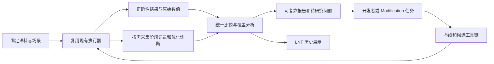

# Styio Analyzer：工具链持续评估与优化设计

日期：2026-09-08。状态：实施设计基线，功能尚未实现或部署。

目标是建立可由开发者、CI 和 Agent 使用的持续评估系统，覆盖 Styio
编译器、生成程序、运行时及语言服务。本文定义长期架构和方法。

首轮实现范围由 [Analyzer v1 规格](STYIO-ANALYZER-V1.md) 定义，按
[实现计划](STYIO-ANALYZER-IMPLEMENTATION-PLAN.md) 交付，由 Cursor 实现后
交回独立验收。[Cursor 开始提示词](prompts/styio-analyzer-v1.cursor.md)
只派发首轮范围。后续 LNT、主动语料扩展和 LLVM 诊断仍保留在本设计中，
不作为首轮实现的隐含任务。

## 结论与对标对象

建议采用 **LLVM test-suite/LNT 的评估结构、rustc-perf 的版本与场景矩阵、
LLVM optimization remarks 的优化归因能力**，在现有 `styio-benchmark`
上建设 Styio Analyzer。Agent 使用这个系统开展研究；固定的程序、采样、
正确性验证和数值分析负责产生证据。

rust-analyzer 是 Rust 的语言服务器，提供补全、跳转、引用和诊断等 IDE
能力，适合对标 Styio 的语言服务。LLVM 的优化基础设施面向多种语言；
Clang 是其中的 C/C++ 前端。语言服务、优化器和性能评估系统分别承担
不同职责。[rust-analyzer 官方介绍](https://rust-analyzer.github.io/book/)

“通用语言”意味着应覆盖多种应用和语言特性组合。语法可以由 Styio 自己
的语料表达，评价维度与实验流程则可以沿用成熟编译器项目的做法。

## 已长期运行的参照

| 参照 | 已有做法 | Styio 的采用方式 |
|---|---|---|
| LLVM test-suite / CTMark | 区分小程序、完整应用、微基准；核对参考输出，记录执行、编译和代码体积；CTMark 选择编译性能样本 | 建立相同层次的 Styio 语料，明确每项测量边界 |
| LLVM LNT | 收集结果、比较版本、呈现长期趋势 | 优先适配现有结果到 LNT，复用历史展示能力 |
| rustc-perf | 固定项目语料、多种编译场景、按编译器版本比较，合入后自动评估 | 以 Styio 版本间变化作为日常评估主线 |
| LLVM optimization remarks | 输出成功、错失及分析类优化记录，支持序列化和差异查看 | 解释哪些转换发生变化，连接到具体函数与工作负载 |
| LLVM 单元、回归与整程序测试 | 分层检查实现行为和完整程序结果 | 沿用 Styio 的现有测试，再为具体优化增加必要检查 |

对应的一手资料：[test-suite Guide](https://llvm.org/docs/TestSuiteGuide.html)、
[LNT Introduction](https://llvm.org/docs/lnt/intro.html)、
[Rust 性能测试流程](https://rustc-dev-guide.rust-lang.org/tests/perf.html)、
[LLVM Remarks](https://llvm.org/docs/Remarks.html)、
[LLVM Testing Guide](https://llvm.org/docs/TestingGuide.html)。

这些流程有多年使用记录。LLVM 在 2016 年的官方文章中已介绍提交前比较、
提交后追踪和长期趋势分析；Rust 在 2020 年已公开介绍编译器 self-profile
工具。目前 rustc-perf 的 collector 还提供运行时评估、代码生成差异和二进制
体积分析。[LLVM 2016 年实践](https://blog.llvm.org/2016/06/using-lnt-to-track-performance.html)、
[Rust 2020 年 self-profile 介绍](https://blog.rust-lang.org/inside-rust/2020/02/25/intro-rustc-self-profile/)、
[rustc-perf collector](https://github.com/rust-lang/rustc-perf/blob/main/collector/README.md)。

上述是来源事实；下面是结合 Styio 的设计建议。没有现成套件可以直接通过
执行 C/C++ 或 Rust 程序，完整覆盖 Styio 的前端、语义和运行时。

## 可以复用的 Styio 基础

以下是 2026-09-08 读取源码和入口文档确认的接口，未据此执行构建或性能
实验。实现时以工作树中的实际接口为准，不能把入口存在视为已通过运行验收。

| 现有资产 | 已确认的用途 | Analyzer 的接入点 |
|---|---|---|
| `tools/standard_parity_gate.py`、`workloads/parity-v2/contract.json` | Styio/C++ 工作负载、三条测量路线、采样与结果分析 | 复用采样与校验实现，增加同语言版本比较视图 |
| `styio-probes/styio_soak_test.cpp` | 编译阶段测量接口 | 编译成本分布和规模变化分析 |
| `async-runtime/` | 独立的跨运行时调度评估 | 保留该领域的场景和指标 |
| `tools/core-benchmark-compare.py` | 既有 core 报告的比较入口 | 保留其独立报告用途，不能将两个历史摘要冒充新采集的配对样本 |
| Styio `CodeGenG.cpp::optimize_module_for_jit` | 已调用 LLVM O2 默认模块优化流水线 | 优化阶段的计时、remarks 与 IR 差异 |
| Styio `src/main.cpp` 原生构建路径 | 已有 Clang 优化构建和构建阶段诊断接口 | 构建、链接和生成程序分别测量 |
| Styio `StyioIDE`、`StyioLSP`、`scripts/ide-perf-gate.sh` | 已有语言服务和延迟检查入口 | 独立的编辑场景评估 |
| Styio `StyioObservable` | 已有静态拓扑及显式启用的运行时观测接口 | 按需接入已支持、已验证开销的诊断能力 |

现有资产说明见 [测量路线](IN_TREE_BENCHMARKS.md)、
[覆盖矩阵](COVERAGE-MATRIX.md) 和 [parity 方法](STANDARD-PARITY.md)。
parity 语料目前是 11 个独立项目微内核，其 `clbg-*`、`llvm-*` 名字表示
历史风格来源，不代表运行了官方套件。新增完整应用和生成语料时应保留
真实来源、能力覆盖与适用边界。

## 评估什么

| 评估面 | 必须回答的问题 | 主要输出 |
|---|---|---|
| 语义与正确性 | 合法程序结果是否正确，错误程序是否得到规定诊断，优化是否保留语义 | 输出验证、错误分类、失败复现 |
| 编译效率 | 时间和内存花在哪些阶段，输入增大时如何增长 | 总构建时间、阶段时间、峰值内存、规模曲线 |
| 生成程序质量 | 同样的工作执行得如何，代码体积有何变化 | 执行时间、吞吐、内存、代码体积；按需附硬件计数 |
| 优化原因 | 哪些转换发生或错失，哪个 lowering 或调用约束影响结果 | remarks、IR/汇编差异、源程序位置 |
| 运行时 | 分配、复制、调度、同步和 I/O 对整体成本有何影响 | 领域指标与完整场景结果 |
| 语言服务 | 项目打开、编辑、诊断、补全是否随规模恶化 | 冷启动、编辑后的延迟分布、内存与增量工作量 |

各评估面单独展示。编译速度、运行速度、内存和 IDE 延迟不合并成一个
“语言总分”。运行成功也不等于易用性已经得到验证；语法可理解性、诊断
帮助程度和完成编程任务的成本仍需要专门的开发者使用研究。

## 主动覆盖的语料体系

采用三种互补语料，评价工作不依赖收到外部问题才启动。

1. **固定的完整应用。** 从解析与格式化、字典聚合、图算法、流式数据处理、
   并发任务流水线等应用族选择可运行的 Styio 程序。固定输入、算法和结果，
   测量完整路径。先完成少量有代表性的应用，再根据覆盖缺口扩充。
2. **按规模生成的语言特性语料。** 从已有 feature catalog 和覆盖矩阵选择
   函数调用、集合、类型推断、资源、控制流、状态等能力，生成可重复的
   小、中、大输入。考察关键组合，例如集合与循环、泛型与调用图、资源与
   异常路径；不枚举所有特性的笛卡尔积。仅对实际支持的能力生成程序。
3. **优化机制语料。** 针对常量传播、内联、循环外提、边界检查、数据布局、
   分配消除、向量化等机制建立小程序。它们用于定位和防止退化，收益还要
   返回完整应用验证。语义必需的复制、检查和同步不能被当作可随意删掉的成本。

每项语料记录能力、规模、输入分布和预期结果。未支持的能力显式标出，
不能通过遗漏用例提高总体评价。新发现先缩减成可复现实例，再补到对应
语料族；只有适合稳定测量的实例才加入日常性能套件。

借用 LLVM/其他项目程序时核对许可证和输入条件。改写成 Styio 的程序是
项目移植语料，不应使用官方套件成绩的名义。C++ 和 Rust 对照也应说明
算法、工作量以及溢出、别名、生命周期等语义差异。

## 一个评估系统，三类比较

| 比较 | 固定什么 | 改变什么 | 回答什么 |
|---|---|---|---|
| Styio 版本 A/B | 语料、输入、构建配置、目标与测量环境 | Styio 编译器/运行时版本 | 此次实现变化带来了哪些收益或退化 |
| LLVM 后端实验 | 输入 IR、目标配置、运行时及测量条件 | LLVM 版本或经过审查的 pass 配置 | 后端变化对这批 IR 有什么影响 |
| 跨语言参照 | 尽量等价的算法、工作量与结果 | 语言实现和工具链 | Styio 与外部实现的差距在哪里 |

日常分析以第一类为主，第三类保留已有 parity 的定义和门槛。某版本比
上一版本慢，与 Styio 是否达到 C++ 对标目标，是两个独立问题。

如果实验改变了 LLVM 版本，就不能同时把变化全部归因于 Styio 前端；
如果只测同一份 IR，就不能据此评价 Styio 的解析或类型推断性能。
冷构建、缓存命中、JIT 首次执行和稳定执行同样需要各自明确边界。真正的
增量编译场景只在实现支持时纳入，不能用缓存命中冒充增量语义分析。

## Analyzer 的最小结构

系统保留一套语料登记、一套采样计算实现及一份可复算结果。新增 Analyzer
入口应组合现有模块；通用部分可从现有 gate 中提取，不能复制一份采样器。
代码、运行时和测量接口由 Styio 仓库负责；语料、测量、比较、报告及历史
适配由 `styio-benchmark` 负责。

LNT 支持独立测试生产者提交 JSON，也支持自定义测试套件和指标；因此可先
做结果适配，验证运行时间、编译时间、代码体积的历史展示，不必先移植它的
C/C++ 执行流程。[LNT 数据导入文档](https://llvm.org/docs/lnt/importing_data.html)

导出必须适配现有隐私规则。展示环境使用非识别性的测量通道标识，允许
区分不可混比的数据；不输出真实机器身份、用户目录、环境变量或原始子进程
文本。LNT 展示中的统计提示与项目的正式验收结论应标明各自来源，数值
验收继续采用项目统一实现，避免两套规则互相覆盖。

## 系统如何解释优化机会

先将程序时间或编译时间关联到主要成本，再读取相关函数的 IR、汇编或
优化诊断。LLVM remarks 可通过已有序列化设施输出，并由现有查看/差异工具
消费；嵌入 LLVM 的 Styio 路径需要显式接入相应接口，不能假设 Clang 命令行
参数已经是 Styio 参数。[LLVM Remarks 接口与工具](https://llvm.org/docs/Remarks.html)

重点检查 Styio 的表示与 lowering 是否保留了可优化信息：

- 静态已知的类型是否仍进入动态查找或装箱路径。
- 循环里的纯计算、长度查询、重复查找是否存在可验证的外提机会。
- 生命周期、别名和调用副作用是否被准确表达，使 LLVM 能安全完成转换。
- 哪些分配、复制、同步来自语言语义，哪些来自实现方式。
- LLVM pass 的成本是否值得，代码膨胀是否抵消执行收益。

这些检查产生待验证的解释。`Missed` 记录不直接等于缺陷，静态调用次数不
等于实际执行次数，诊断数量也不作为性能得分。别名、内存副作用等属性必须
从真实语义推出；不能为了让优化触发而添加不成立的承诺。

每个发现只需保存：受影响语料与指标、复现条件、已有证据、待验证原因和
一次最小实验。计时与会改变开销的诊断采集分别执行；有噪声的结果保持
不确定状态。规模曲线用于发现异常增长，再通过测量和源码确认复杂度原因。

## 稳定的开发循环

| 时机 | 运行范围 | 产出 |
|---|---|---|
| 日常修改 | 修改涉及的正确性检查与小型固定性能子集 | 快速发现局部变化 |
| 准备接收性能候选 | 基线/候选的定向独立比较，必要的完整应用 | 收益、代价及不确定性 |
| 实现、审阅及定向验证完成后 | 对本次交付执行一次最终完整回归 | 此候选的交付结论 |
| 后续获授权的 CI 合入任务 | 固定的常规性能套件，使用可比测量通道 | 按版本积累趋势 |
| 周期性的专项评估 | 完整应用、放大规模、输入分布及目标平台 | 覆盖缺口和新的研究问题 |

这是未来设施的触发设计，本次没有创建自动化或运行定时任务。性能趋势
采集不等于反复执行开发交付的完整回归；若最终完整回归失败，按仓库规则
先报告诊断与修复建议，由开发者决定后续修复和是否重跑。

Benchmark 任务维护测量证据，Modification 任务修改实现并完成正确性验证。
修改候选交给独立测量方复验。评价流程应当能够在没有 Agent 参与时完成，
Agent 负责扩充覆盖、研究原因和提出实现方案。

## 建设顺序与可独立验收的交付

| 交付 | 范围 | 完成条件 |
|---|---|---|
| 1. 同语言版本比较闭环 | 按 v1 规格复用当前语料和测量模块，显式选择 Styio 基线/候选；统一汇总正确性、各路线耗时、已有内存指标和产物体积 | 一次执行得到逐用例差异与原始样本；不支持和不确定结果明确；确定性 A/A 样本正确归类，真实 A/A 用于检查测量偏差 |
| 2. 历史结果接入 | 将第一项结果适配到 LNT，按版本和测量通道查询 | 同一指标可以追溯到原始结果；缺失、失败及环境变更不被展示成收益；部署环境另行落实 |
| 3. 主动覆盖与优化归因 | 补完整应用和按规模生成语料，接入现有阶段记录及必要的 LLVM remarks | 可从整体变化定位到阶段/函数，并给出可复现的候选实验；诊断不污染正式计时 |
| 4. 运行时与语言服务扩展 | 复用现有异步及 IDE 入口，补各领域的实际场景 | 指标与场景独立呈现；能够解释吞吐、尾延迟、内存或编辑响应的变化 |

第一项先交付完整的版本比较能力。
后续每项都交付一个可以独立运行和验收的能力。已有 parity 门槛、闭合路线
及公开报告契约保持既有语义；实现时应复用其内部模块，并为
新增比较类型提供清晰入口。

本方案的成熟度来自稳定语料、清晰测量边界、独立验证及持续积累的结果。
LLVM 和 Rust 提供了可借用的工程做法；Styio 的代表性程序、语义覆盖和
观测接口仍需要项目自身长期建设。
